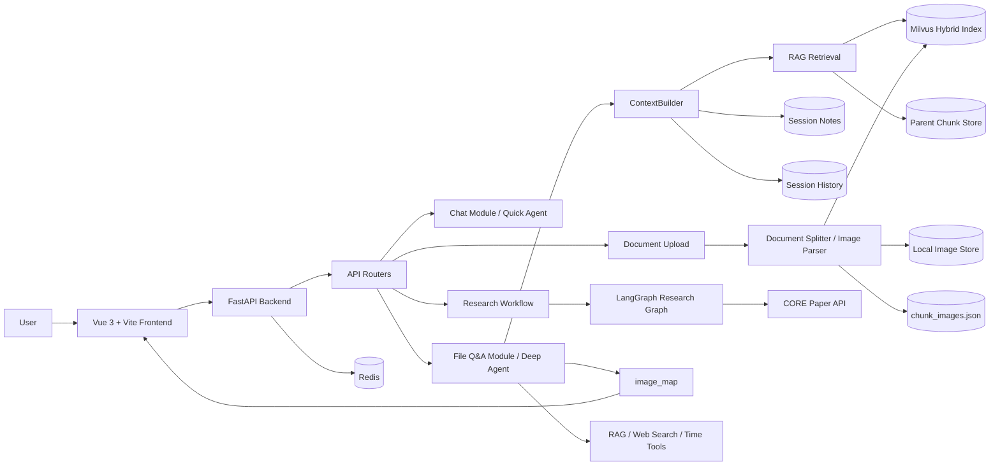

# MyPaperWeb

[中文说明](README.zh-CN.md)

MyPaperWeb is an Agentic RAG web application for paper reading, document Q&A, and research-oriented analysis. It combines a Vue 3 frontend, a FastAPI backend, Milvus vector retrieval, and LangChain/LangGraph based agents to support chat, file-grounded question answering, and scientific research workflows.

The project is designed as a practical AI application rather than a single prompt demo. It includes document ingestion, multi-level chunking, vector indexing, context engineering, module-isolated agents, streaming responses, visual document Q&A, long-term notes, and evaluation utilities.

## Features

- **Chat Assistant**: everyday Q&A with streaming responses.
- **File Q&A**: upload documents and ask questions grounded in indexed content.
- **Research Workflow**: search papers, download papers, generate research plans, answer with evidence, and run a judge feedback loop.
- **Module Isolation**: separates quick chat, file-grounded Q&A, and research workflow sessions.
- **Context Builder**: structures RAG context through `Gather -> Select -> Structure -> Compress -> Assemble`.
- **Hybrid Retrieval**: combines dense embedding retrieval with sparse BM25-style retrieval in Milvus.
- **Visual Document Q&A**: extracts images from PDF/DOCX files, keeps image placeholders in chunks, and renders related images in answers.
- **Long-Term Notes**: stores high-value session memories such as preferences, constraints, summaries, and decisions.
- **Session History**: separates chat, file, and research histories.
- **Evaluation Module**: provides cases, metrics, runner, and reports for agent behavior checks.

## Tech Stack

| Layer | Technologies |
| --- | --- |
| Frontend | Vue 3, Vite, marked, highlight.js |
| Backend | FastAPI, SSE, Redis, SQLAlchemy |
| Agents | LangChain, LangGraph, deepagents |
| RAG | Milvus, pymilvus, DashScope embeddings, rerank API |
| Documents | PyPDF, PyMuPDF, pdfplumber, docx2txt, python-docx, Pillow, unstructured, openpyxl |
| Search | Web search API, CORE API, Elasticsearch |
| Infrastructure | Docker Compose, Milvus, MinIO, etcd, Attu |

## Architecture Overview

MyPaperWeb uses a modular full-stack architecture. The frontend is responsible for module switching, streaming rendering, file upload, and image placeholder rendering. The backend exposes separate FastAPI routers for quick chat, file Q&A, research workflow, authentication, and retrieval-related utilities.

The system intentionally separates **agent execution**, **context construction**, **document indexing**, and **runtime storage**. This keeps the normal chat path lightweight while allowing the file module to use deeper RAG context and tools.



## Core Design Highlights

### Modular Agent Flow

The application is split into three user-facing modules:

- **Chat Assistant** uses the quick agent for everyday conversation and avoids unnecessary RAG calls.
- **File Q&A** uses the deep agent, retrieval tools, document context, and optional long-term notes.
- **Research** uses an independent LangGraph workflow for paper search, planning, tool execution, and answer review.

Each module has its own frontend session state and backend history path, so chat, file Q&A, and research conversations do not pollute each other.

### Context Engineering

The context layer is separated from the agent layer. `ContextBuilder` collects history, notes, and retrieval candidates, selects relevant evidence, structures the context, compresses it under budget, and assembles a model-ready context bundle. This avoids duplicating prompt construction logic across agents.

### Document-Centered RAG

Uploaded files are parsed, split, embedded, and written to Milvus. Retrieval combines dense embeddings and sparse BM25-style vectors. The system also stores parent chunks separately so multiple small retrieved chunks can be merged back into larger parent context.

### Visual Document Q&A

For PDF/DOCX files with images, the indexing pipeline extracts document images into local runtime storage and inserts placeholders such as:

```text
<<IMAGE:a1b2c3d4>>
```

The placeholder stays in the chunk text so the model can cite the image position in its answer. The backend returns an `image_map`:

```json
{
  "<<IMAGE:a1b2c3d4>>": "/file/image/a1b2c3d4"
}
```

The frontend replaces the placeholder with the real image during Markdown rendering. This makes the file module support text-and-image grounded answers without requiring a full multimodal vector index.

### Long-Term Notes

The deep/file agent can persist high-value memories into `app/data/notes/`, including user preferences, constraints, decisions, summaries, and blockers. Notes are scoped by session and can be loaded back into the context builder for later turns.

### Research Workflow

The research module uses a LangGraph workflow:

```text
decision -> planning -> agent -> tools -> agent -> judge
```

It can decide whether a full research flow is needed, create a research plan, use paper search/download tools, generate an answer, and run a judge node for quality feedback.

### Streaming Response Flow

The frontend supports both normal and SSE streaming responses. Each module has its own default output mode: quick chat defaults to normal output, while file Q&A and research default to streaming. Streaming events are normalized on the frontend so partial content, final answers, errors, and `image_map` metadata can be handled consistently.

## Project Structure

```text
mypaperweb/
├── app/
│   ├── agents/              # quick, deep, file, and research agents
│   ├── context/             # context gather/select/structure/compress/assemble pipeline
│   ├── routers/             # FastAPI routers
│   ├── services/            # Milvus, indexing, splitting, image, notes, and user services
│   ├── tools/               # agent tools
│   ├── evaluation/          # evaluation runner, metrics, reports, cases
│   ├── data/                # local runtime data, ignored by Git
│   └── settings/            # environment-driven configuration
├── frontend/
│   └── src/                 # Vue frontend
├── alembic/                 # database migrations
├── vector-database.yml      # Milvus standalone stack
├── requirements.txt         # backend dependencies
├── .env.example             # environment variable template
└── start-windows.bat        # local Windows startup helper
```

## Quick Start

### Docker (recommended, one command for the full stack)

Requires only Docker Desktop. The compose file orchestrates the backend (FastAPI), frontend (nginx-served React build), Milvus standalone (with etcd + MinIO) and Redis:

```powershell
# Pass your API keys via host environment variables (compose forwards them into the backend)
$env:DASHSCOPE_API_KEY="sk-..."
docker compose up -d --build
```

Then open:

- Frontend: http://localhost:5174
- Backend API docs: http://localhost:8080/docs
- Optional Milvus admin console (Attu): add `--profile tools` → http://localhost:8001
- Optional MySQL (login / chat history features): add `--profile mysql`

Persisted data (uploaded documents, notes, checkpoints, research artifacts) lives in Docker volumes — run `docker compose down` (without `-v`) to stop while keeping data.

> Port 5174 is used to avoid clashing with the sibling LLMOps platform stack (5173). If you only run this project, change the frontend port mapping to `5173:80` in `docker-compose.yml`.

### Local development (without Docker)

#### 1. Prepare Environment Variables

Copy the example file and fill in your local values:

```bash
copy .env.example .env
```

Required values include model API keys, Milvus settings, Redis URL, database URL, mail settings, and optional search API keys.

### 2. Start Milvus

```bash
docker compose -f vector-database.yml up -d
```

Attu is exposed at:

```text
http://localhost:8000
```

### 4. Start Backend

```bash
cd app
python main.py
```

Default backend URL:

```text
http://127.0.0.1:8080
```

API docs:

```text
http://127.0.0.1:8080/docs
```

### 5. Start Frontend

```bash
cd frontend
npm install
npm run dev
```

Default frontend URL:

```text
http://127.0.0.1:5173
```

## Windows Helper Scripts

For local Windows development, the project includes:

```bash
start-windows.bat
stop-windows.bat
```

Before using `start-windows.bat`, check the Python path inside the script and adjust it to your local virtual environment.

## API Modules

| Prefix | Purpose |
| --- | --- |
| `/agent` | quick chat assistant |
| `/file` | file upload, indexing, and file-grounded Q&A |
| `/research` | research workflow chat |
| `/auth` | email code, register, login |
| `/elasticsearch` | Elasticsearch demo endpoints |

## Runtime Data

Runtime data is intentionally ignored by Git:

```text
uploads/
chat_history/
volumes/
app/data/*.json
app/data/notes/
app/data/images/
```

These files are generated locally during indexing, chat, and Milvus usage. They should not be committed as source code.

## Verification

Useful lightweight checks:

```bash
python -m py_compile app/main.py app/routers/agent.py app/routers/file.py app/routers/research.py
python -m unittest tests.test_milvus_client_service tests.test_verification_code
```

Frontend build:

```bash
cd frontend
npm run build
```

## Interview Talking Points

- Built a full-stack Agentic RAG application instead of a simple chatbot wrapper.
- Designed a reusable context engineering pipeline for history, retrieval evidence, compression, and prompt assembly.
- Separated quick chat, file-grounded Q&A, and research workflow into independent modules and sessions.
- Added document upload, incremental indexing, Milvus hybrid retrieval, and parent-child chunk merging.
- Added visual document Q&A through image extraction, placeholders, backend `image_map`, and frontend Markdown image rendering.
- Added session-level long-term notes for preferences, constraints, summaries, and reusable context.
- Built a LangGraph research workflow with planning, tool execution, and judge feedback.
- Added evaluation scaffolding for checking routes, tools, keywords, context mode, and answer quality.

## Internship / Resume Kit

The repo includes a focused package for internship applications with five measurable stories. The numbers below should be read as repository benchmarks or evaluation artifacts rather than broad production claims.

### 1. Context Compression (Hermes Agent 风格)
四阶段上下文压缩管线（修剪 → 边界 → 摘要 → 清洗），默认 32K 窗口、50% 触发阈值。
- 在当前仓库的 `scripts/benchmark_context_compression.py` 基准中，**超长对话场景**可观察到 **84.5% token 节省**（约 26K → 4K tokens）。
- 在同一基准的**紧凑配置 / 长对话场景**下，可观察到 **52.5% 节省**，且脚本内定义的 `8/8` 关键检查项全部保留。
- 多轮模拟中，不同配置下的平均节省约为 **16-19%**；防抖结果应结合具体配置和场景解读。
- 参考: [Hermes Agent](docs/enhancement-hermes-reference.md)

### 2. Checkpoint 工作流恢复 (AgentSPEX 风格)
JSON 文件持久化的多步骤工作流中断恢复系统。
- 在当前 `scripts/benchmark_checkpoint_recovery.py` 基准中，**6/6 场景恢复成功**，覆盖早期 / 中间 / 尾部中断和大规模步骤场景。
- 同一基准中，已完成步骤保持 **0 步错误重执行**，总计 **50 步被正确跳过**。
- 恢复耗时属于环境相关指标；当前仓库一次本地运行约为 **47ms 平均恢复时间**，已完成工作流恢复约 **1-2ms**。
- 参考: [AgentSPEX (arXiv:2604.13346v1)](docs/enhancement-agentspex-reference.md)

### 3. 检索排序增强 (GBrain Source Boost 风格)
Source Boost + Keyword Boost 重排序，作用于 Research Workflow 中 `academic_tools_service.search_papers()` 返回的**论文搜索结果**（来自 CORE API 等外部引擎），不作用于 Milvus 文档召回。
- 在当前 `scripts/benchmark_search_ranking.py` 的 **20-query 在线 benchmark** 中，`strict Top-3` 命中率从 **55.0% 提升至 65.0%**，`MRR` 从 **0.018 提升至 0.091**。
- 同一基准中，`strict Top-5` 保持 **75.0%**，说明当前增强更偏向前排精排，而不是扩大 Top-5 覆盖。
- 另一个 `scripts/benchmark_ranking_offline.py` 的*离线合成数据集*基准仍可复现更高的 `loose Top-3` 结果，但它和当前在线 benchmark 属于不同评估口径，不应混用。
- 参考: [GBrain Source Boost](docs/enhancement-gbrain-reference.md)
### 4. 结构化记忆 (Structured Memory)
四类型（USER / FEEDBACK / PROJECT / REFERENCE）持久化记忆系统，五道写入门（低价值拦截 → 可推导拦截 → 类型推断 → 内容构建 → 去重）。
- 在 `scripts/benchmark_structured_memory.py` 中，写入门控部分表现为 **10/10 应保存样本正确写入**、**0 误存 / 0 漏存**。
- 同一基准中，**5/5 低价值样本被拦截**，写入类型分类结果为 **10/10 正确**。
- 检索侧指标更适合配套说明：**Top-3 关键词召回率为 89%（8/9）**，同时该脚本中的负样本仍存在误召回，因此这部分更适合描述为“当前关键词召回基准”而非完整记忆质量结论。
- 证据位置: `scripts/benchmark_structured_memory.py`, `tests/test_structured_memory.py`

### 5. Agent 行为稳定性评估
11 个端到端测试用例覆盖 quick chat / deep RAG / tool 调用 / notes 读取四类场景。
- 当前评估框架包含 **11 个端到端 case**，覆盖 quick chat / deep RAG / tool 调用 / notes-aware reasoning，定义见 `app/evaluation/cases.json`。
- 在已生成并提交的评估报告 `app/evaluation/reports/report.json` 中，当前记录结果为 **11/11 通过**，工具调用准确率 / 关键词命中率 / 证据命中率均为 **100%**。
- 同一报告中的平均得分为 **0.9818**，README 中可近似记为 **0.98**。
- 参考: `app/evaluation/`, `scripts/run_eval.py`

详细设计文档: [docs/internship-ready-project-pack.md](docs/internship-ready-project-pack.md)

Suggested supporting checks:

```bash
pytest tests/test_context_compressor_service.py tests/test_checkpoint.py tests/test_entity_extraction.py tests/test_structured_memory.py tests/test_workflow_engine.py -q
```

## Future Improvements

- Add a production deployment guide and Dockerfile for the FastAPI/Vue services.
- Expand automated tests for routers, file upload, indexing, and frontend interactions.
- Replace demo Elasticsearch credentials with environment-driven configuration.
- Add screenshots or a short demo GIF for GitHub presentation.
- Add authentication tokens after login and protect user-specific resources.
