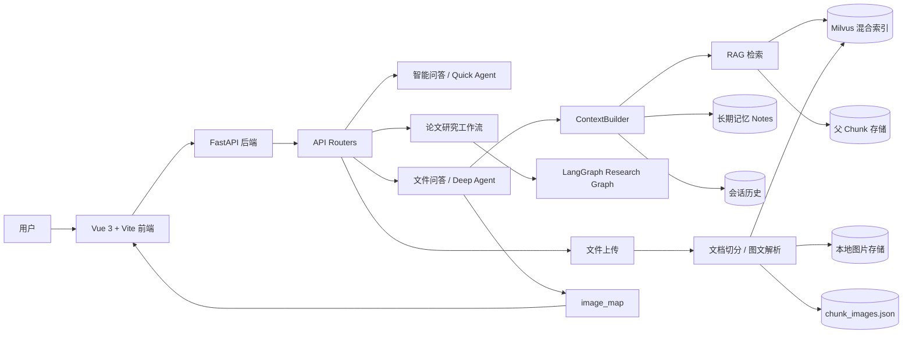

# MyPaperWeb 中文说明

MyPaperWeb 是一个面向论文阅读、文档问答和研究分析的 Agentic RAG Web 应用。项目使用 Vue 3 + Vite 构建前端，FastAPI 构建后端，Milvus 负责向量检索，并结合 LangChain、LangGraph、deepagents 实现多模块智能问答。

这个项目不是简单的聊天机器人封装，而是一个完整的 AI 应用实践，包含文档上传、文档切分、向量索引、混合检索、上下文工程、流式输出、图文文档问答、长期记忆和研究工作流。

## 核心功能

- **智能问答**：用于日常快速问答，默认不走 RAG，响应更快。
- **文件问答**：上传 PDF、DOCX、Markdown、Excel 等文件后，基于文档内容进行问答。
- **图文文档问答**：解析 PDF/DOCX 中的图片，保留图片位置，并在回答中渲染相关图片。
- **论文研究工作流**：支持论文搜索、下载、研究计划生成、工具调用和 judge 反馈。
- **混合检索**：结合 dense embedding 和 BM25 风格稀疏检索，提高召回质量。
- **上下文工程**：通过 `Gather -> Select -> Structure -> Compress -> Assemble` 组织模型上下文。
- **长期记忆**：按会话保存高价值偏好、约束、总结和决策。
- **流式输出**：文件问答和研究模块默认使用 SSE 流式响应。
- **来源展示**：文件问答会展示相关文档片段，方便追溯答案依据。
- **健康检查**：提供 `/health` 接口和 `scripts/check_env.py` 用于检查本地环境。

## 技术栈

| 层级 | 技术 |
| --- | --- |
| 前端 | Vue 3, Vite, marked, highlight.js |
| 后端 | FastAPI, SSE, Redis, SQLAlchemy |
| Agent | LangChain, LangGraph, deepagents |
| RAG | Milvus, pymilvus, DashScope embeddings, rerank API |
| 文档解析 | PyPDF, PyMuPDF, pdfplumber, docx2txt, python-docx, Pillow, unstructured, openpyxl |
| 搜索 | Web Search API, CORE API, Elasticsearch |
| 基础设施 | Docker Compose, Milvus, MinIO, etcd, Attu |

## 架构说明

MyPaperWeb 采用模块化架构。前端负责模块切换、会话状态、流式渲染、文件上传和图片占位符渲染；后端通过 FastAPI 暴露智能问答、文件问答、研究工作流、登录认证、健康检查等接口。

系统将 **Agent 执行**、**上下文构建**、**文档索引** 和 **运行数据存储** 分开处理。这样普通智能问答可以保持轻量，文件问答则可以使用更完整的 RAG 上下文和工具。



## 关键设计

### 1. 模块隔离

项目将用户入口拆成三个模块：

- **智能问答**：适合日常快速问题，不默认调用 RAG。
- **文件问答**：适合围绕上传文档进行检索、总结、解释和追问。
- **论文研究**：适合论文搜索、下载、研究计划和多步分析。

三个模块在前端和后端都保持独立会话，避免聊天历史互相污染。

### 2. 上下文工程

`ContextBuilder` 负责统一收集历史、长期记忆和检索候选内容，并进行选择、结构化、压缩和组装。这样不同 Agent 不需要重复拼 prompt，也更容易控制上下文预算。

### 4. 图文文档问答

对于包含图片的 PDF/DOCX，系统会把图片提取到本地运行目录：

```text
app/data/images/
```

同时在 chunk 文本中插入图片占位符：

```text
<<IMAGE:a1b2c3d4>>
```

后端回答时返回：

```json
{
  "<<IMAGE:a1b2c3d4>>": "/file/image/a1b2c3d4"
}
```

前端会把占位符替换成真实图片。这样可以在不引入完整多模态向量库的情况下，实现“文档内容 + 原图展示”的图文 RAG 效果。

### 5. 文件问答来源展示

文件问答完成后，后端会基于问题再检索相关文档片段，并返回 `sources`。前端在回答下方展示文件名、页码和片段预览，方便用户追溯答案依据。

### 6. 长期记忆

Deep/File Agent 会根据问题和回答自动提取高价值信息，例如：

- 用户偏好
- 必须遵守的约束
- 重要总结
- 决策结论
- 风险和问题

这些内容按 session 保存到：

```text
app/data/notes/
```

后续对话可以把这些 notes 重新加入上下文。

## 项目结构

```text
mypaperweb/
|-- app/
|   |-- agents/              # quick, deep, file, research agents
|   |-- context/             # 上下文工程 pipeline
|   |-- routers/             # FastAPI 路由
|   |-- services/            # Milvus、索引、图文解析、健康检查等服务
|   |-- tools/               # Agent 工具
|   |-- evaluation/          # 评估用例、指标和报告
|   |-- data/                # 本地运行数据，Git 忽略
|   `-- settings/            # 环境配置
|-- frontend/
|   `-- src/                 # Vue 前端
|-- alembic/                 # 数据库迁移
|-- vector-database.yml      # Milvus standalone stack
|-- requirements.txt         # 后端依赖
|-- .env.example             # 环境变量模板
|-- scripts/check_env.py     # 本地环境检查脚本
`-- start-windows.bat        # Windows 启动辅助脚本
```

## 快速启动

### 1. 准备环境变量

```bash
copy .env.example .env
```

然后填写 `.env` 中的模型 API Key、Milvus、Redis、数据库、搜索 API 等配置。

### 2. 启动 Milvus

```bash
docker compose -f vector-database.yml up -d
```

### 4. 启动后端

```bash
cd app
python main.py
```

默认后端地址：

```text
http://127.0.0.1:8080
```

API 文档：

```text
http://127.0.0.1:8080/docs
```

健康检查：

```text
http://127.0.0.1:8080/health
```

### 5. 启动前端

```bash
cd frontend
npm install
npm run dev
```

默认前端地址：

```text
http://127.0.0.1:5173
```

## 环境检查

项目提供了本地检查脚本：

```bash
python scripts/check_env.py
```

严格模式：

```bash
python scripts/check_env.py --strict
```

检查内容包括：

- `.env` 是否存在
- 关键 API Key 是否配置
- Milvus、Redis、数据库端口是否可连通
- Python 依赖是否可导入
- 前端依赖是否安装
- 运行数据目录是否存在

## 运行数据

以下目录和文件属于运行数据，不应该提交到 Git：

```text
uploads/
chat_history/
volumes/
app/data/*.json
app/data/notes/
app/data/images/
```

## 面试讲解重点

- 这是一个完整的 Agentic RAG 全栈应用，不是单 prompt demo。
- 前端、后端、RAG、Agent、Research Workflow 都有清晰分层。
- 文件问答使用 Milvus 混合检索和上下文工程。
- 支持图文文档问答，可以把 PDF/DOCX 中的图片渲染回回答。
- 支持流式输出、来源展示、长期记忆和健康检查。
- 有测试、环境检查脚本和 README 文档，方便别人 clone 后运行。

## 实习 / 简历量化包

仓库里还整理了一组适合实习、简历和面试复用的量化故事。下面的数字更适合表述为“当前仓库中的基准结果或评估产物”，而不是无边界的生产结论。

### 1. 上下文压缩（Hermes Agent 风格）

四阶段上下文压缩管线（修剪 → 边界 → 摘要 → 清洗），默认 32K 窗口、50% 触发阈值。

- 在当前仓库的 `scripts/benchmark_context_compression.py` 基准中，**超长对话场景**可观察到 **84.5% token 节省**（约 26K → 4K tokens）。
- 在同一基准的**紧凑配置 / 长对话场景**下，可观察到 **52.5% 节省**，且脚本定义的 `8/8` 关键检查项全部保留。
- 多轮模拟中，不同配置下的平均节省约为 **16-19%**；防抖结果需要结合具体配置和场景一起解读。
- 参考：`scripts/benchmark_context_compression.py`，以及 [docs/enhancement-hermes-reference.md](docs/enhancement-hermes-reference.md)

### 2. Checkpoint 工作流恢复（AgentSPEX 风格）

基于 JSON 文件持久化的多步骤工作流中断恢复系统。

- 在当前 `scripts/benchmark_checkpoint_recovery.py` 基准中，**6/6 场景恢复成功**，覆盖早期 / 中间 / 尾部中断和大规模步骤场景。
- 同一基准中，已完成步骤保持 **0 步错误重执行**，总计 **50 步被正确跳过**。
- 恢复耗时属于环境相关指标；当前仓库一次本地运行约为 **47ms 平均恢复时间**，已完成工作流恢复约 **1-2ms**。
- 参考：`scripts/benchmark_checkpoint_recovery.py`，以及 [docs/enhancement-agentspex-reference.md](docs/enhancement-agentspex-reference.md)

### 3. 检索排序增强（GBrain Source Boost 风格）
在 citation-based baseline 之上加入 Source Boost + Keyword Boost 重排序。
- 在当前 `scripts/benchmark_search_ranking.py` 的 **20 条 query 在线 benchmark** 中，`strict Top-3` 命中率从 **55.0% 提升至 65.0%**，`MRR` 从 **0.018 提升至 0.091**。
- 同一基准中，`strict Top-5` 保持 **75.0%**，说明当前增强更偏向前排精排，而不是扩大 Top-5 覆盖。
- 另一个 `scripts/benchmark_ranking_offline.py` 的*离线合成数据集*基准仍可复现更高的 `loose Top-3` 结果，但它和当前在线 benchmark 属于不同评估口径，不应混用。
- 参考：`scripts/benchmark_ranking_offline.py`，以及 [docs/enhancement-gbrain-reference.md](docs/enhancement-gbrain-reference.md)
### 4. 结构化记忆（Structured Memory）

四类型（USER / FEEDBACK / PROJECT / REFERENCE）持久化记忆系统，带五道写入门（低价值拦截 → 可推导拦截 → 类型推断 → 内容构建 → 去重）。

- 在 `scripts/benchmark_structured_memory.py` 中，写入门控部分表现为 **10/10 应保存样本正确写入**、**0 误存 / 0 漏存**。
- 同一基准中，**5/5 低价值样本被拦截**，写入类型分类结果为 **10/10 正确**。
- 检索侧指标更适合配套说明：**Top-3 关键词召回率为 89%（8/9）**，同时该脚本中的负样本仍存在误召回，因此这部分更适合描述为“当前关键词召回基准”而非完整记忆质量结论。
- 证据位置：`scripts/benchmark_structured_memory.py`、`tests/test_structured_memory.py`

### 5. Agent 行为稳定性评估

端到端评估覆盖 quick chat / deep RAG / tool 调用 / notes-aware reasoning 四类场景。

- 当前评估框架包含 **11 个端到端 case**，定义见 `app/evaluation/cases.json`。
- 在已生成并提交的评估报告 `app/evaluation/reports/report.json` 中，当前记录结果为 **11/11 通过**，工具调用准确率 / 关键词命中率 / 证据命中率均为 **100%**。
- 同一报告中的平均得分为 **0.9818**，简历或 README 中可近似记为 **0.98**。
- 参考：`app/evaluation/`、`scripts/run_eval.py`

详细设计文档：[docs/internship-ready-project-pack.md](docs/internship-ready-project-pack.md)

## 后续优化方向

- 增加 Demo 截图或演示 GIF。
- 给 `/file/upload` 增加更完整的接口级测试。
- 增加 Dockerfile，实现前后端一键部署。
- 把图文 RAG 升级为真正的多模态向量检索。
- 增加用户级数据隔离和登录后的访问控制。
